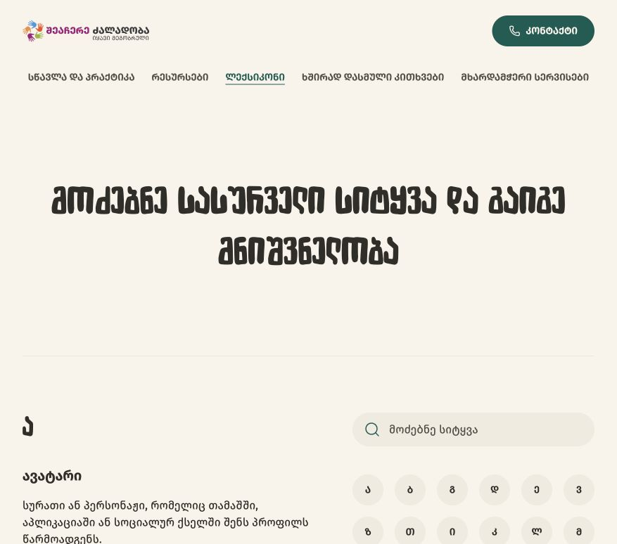
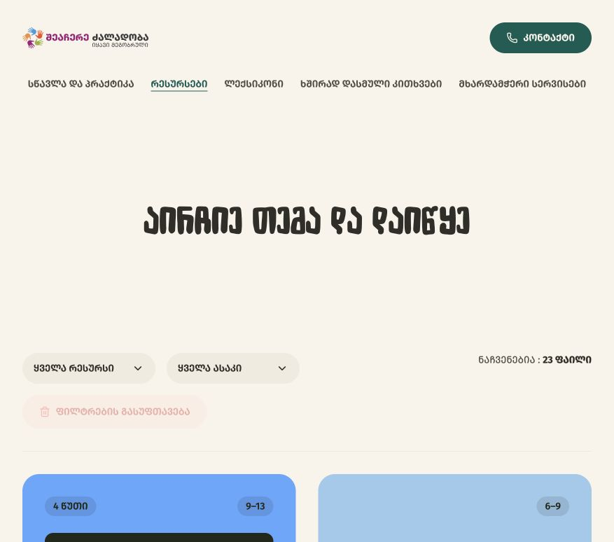
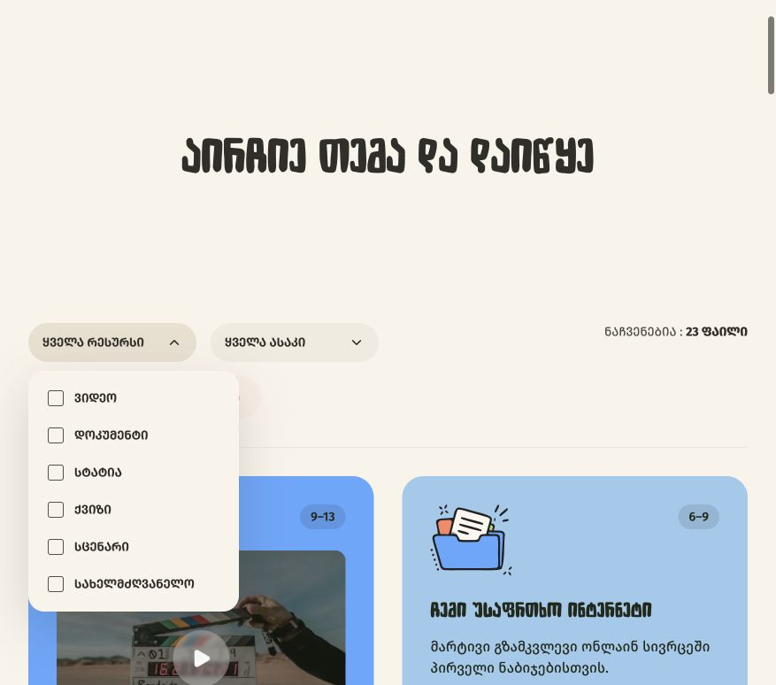
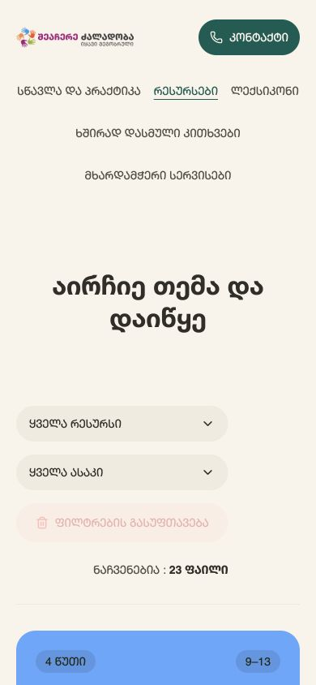
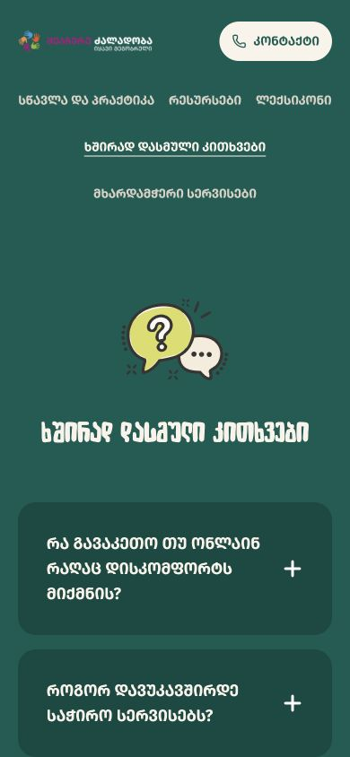
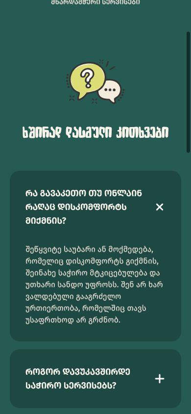
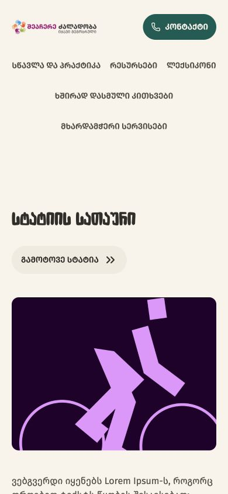
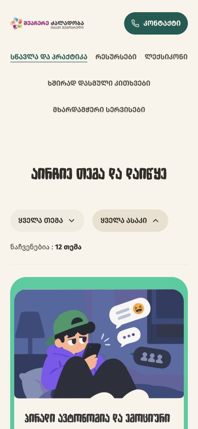
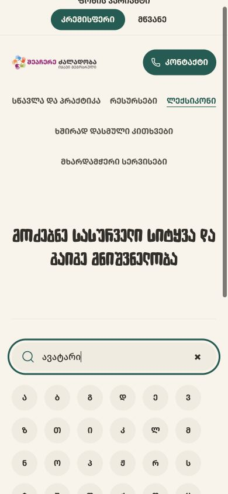

# Component consistency audit — 14 September 2026

Verdict: the main approved repeated controls are extracted. No further large component extraction is needed before icon work. Two small consistency items remain. This was a read-only audit of source and selected live preview states; no product code changed.

## Findings

1. **Icons are the next priority.** Header phone and filter chevrons use Lucide; search, reset, download, play, and accordion icons use separate SVG files; search clearing uses a text multiplication sign. Search SVG uses a 1.5px stroke, download uses 2px, and reset embeds its own coral color/opacity instead of inheriting the control color. These are inconsistent rendering paths and optical weights, even where the artwork resembles the same family. Choose one UI icon family and centralize sizing, stroke and currentColor. Keep illustrations and logos separate. Evidence: steps 2, 3, 5, 7, 10; ui/search-field.tsx, ui/filters.tsx, ui/accordion.tsx, resource-card.tsx and corresponding assets.
2. **Result count typography remains page-specific.** Resources uses the small body token plus label casing; Learning renders its count with separate page rules and natural Georgian casing. Standardize the treatment when doing the final small cleanup. Evidence: steps 2/4 versus 8; resources.module.css .count and learning-page.tsx count paragraph.
3. **Empty results still have separate presentation rules.** Glossary uses 24px heading spacing / 32px paragraph spacing; Resources uses 16px / 28px and centers its block. Different alignment may be intentional because their layouts differ, but text spacing should be reviewed together. This is a source finding, not a visually tested empty-state comparison. A small shared EmptyState could help if both designs are approved; no need to build a broad component now.
4. **Mobile header is a later design decision.** At 390px the five navigation links wrap across three rows and occupy substantial vertical space. It is already shared, so extracting another component would not solve this. Decide on mobile navigation before final motion work. Evidence: steps 4, 5, 7, 10. No redesign proposed or applied during this audit.

## What is covered

Buttons, accordion questions, filter triggers/panels, search, resource/learning cards, separators, alphabet selection, reset controls and badges use the shared implementation. Remaining native buttons belong to prototype appearance switches, the WIP age dialog, or the intentional media trigger inside the resource card. Those are not missed generic Button migrations. No separate border-top/bottom separator rules remain in the active page components. Badge styling has one appearance.

## Captured steps

1. Glossary, normal viewport (877px): healthy shared search/alphabet/separator composition.

2. Resources, normal viewport: healthy shared filters/reset and badges; result count differs from Learning.

3. Resource filter open: healthy panel placement and retained open-trigger background; icon family consistency remains.

4. Resources, 390px: no document horizontal overflow in this captured state; mobile navigation is tall. Shared controls fit.

5. FAQ, 390px, closed: healthy wrapping and shared accordion styling.

6. FAQ, 390px, expanded: answer expands and reads correctly; close-shaped indicator is the rotated plus asset.

7. Article, 390px: skip action fits and uses shared Button; double-chevron style belongs in icon review. Article content is placeholder and was not critiqued.

8. Learning, 390px: shared card and filters fit; count treatment differs from Resources. Age dialog flow is WIP and excluded. Capture reflects visible page beneath that prototype state, not approval of its dialog behavior.

9. Homepage, normal viewport (877px): hero and contact buttons are consistent; logo/artwork are outside UI icon scope. The screenshot filename says mobile, but this existing tab retained its normal viewport.

10. Glossary search, 390px: one matching result is announced; input focus ring is visible. Clear icon has a visibly different, heavier text-glyph shape. Clearing restored the unfiltered state.

## Limits and next step

This is not a full accessibility certification or exhaustive responsive regression test. Inspected semantics include named search, alphabet toolbar, filter controls, accordion expansion and result announcements. Keyboard/screen-reader coverage across every state, color contrast measurement, all screen widths, and every card combination were not repeated. Prior implementation checks remain useful but are not fresh audit evidence. Dialogs, large age/scenario CTA, old prototype and animated CardDeck remain excluded.

Recommended order: unify UI icons → small count/empty-state cleanup and mobile navigation decision → motion. No icon library was installed and no source styles were changed in this audit.
