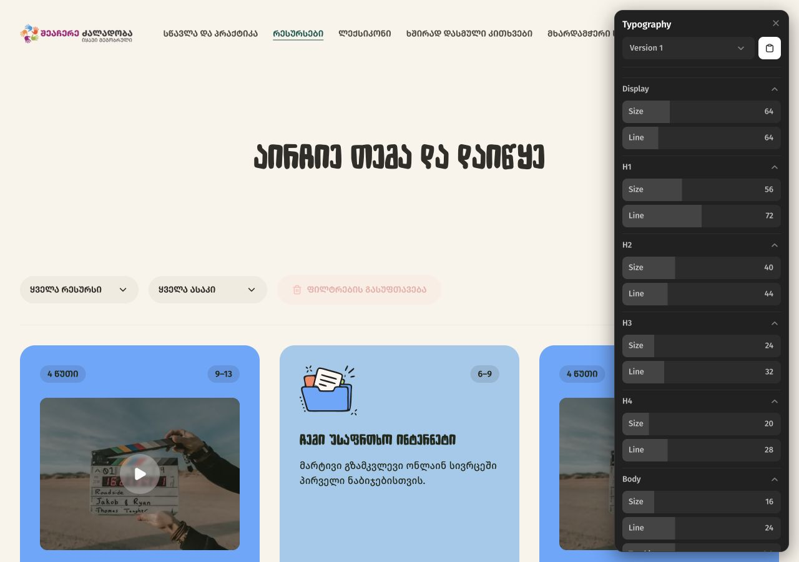
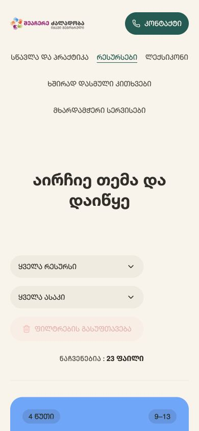
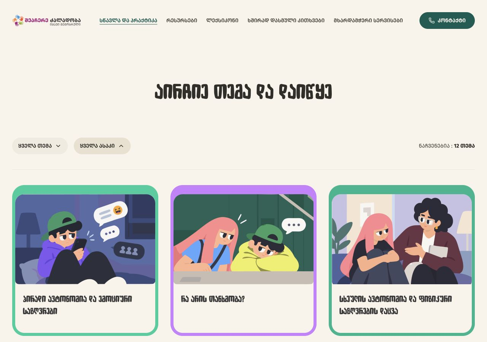
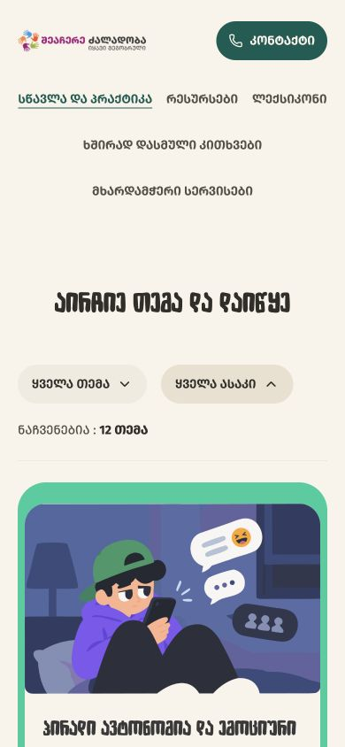
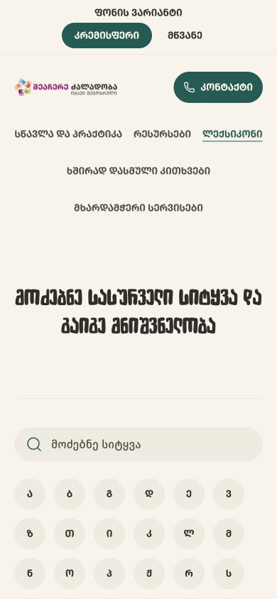
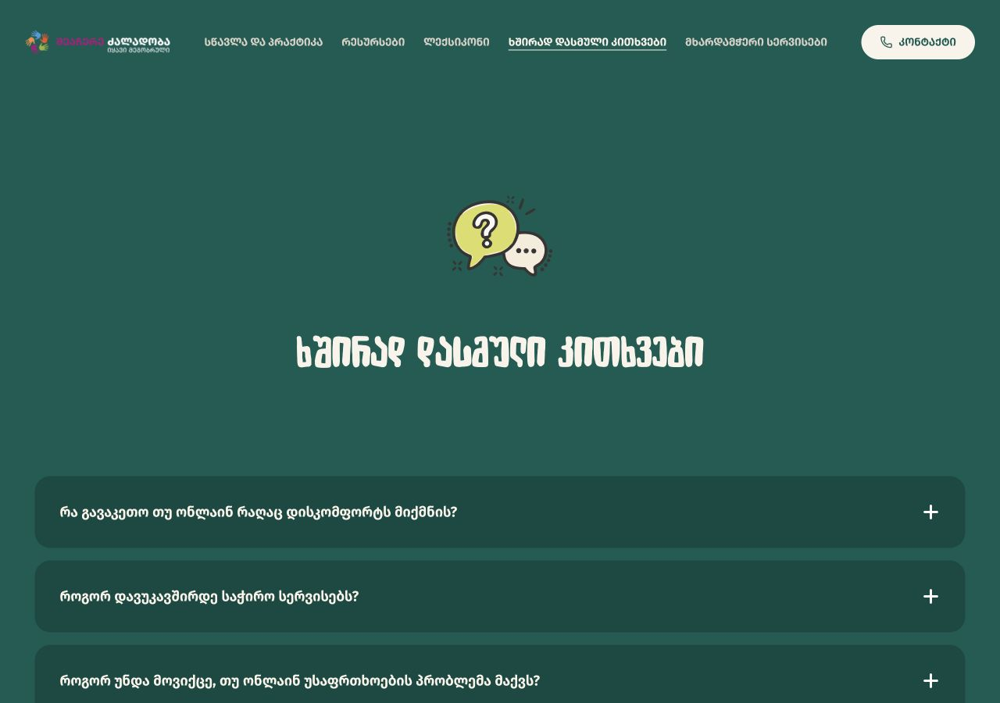
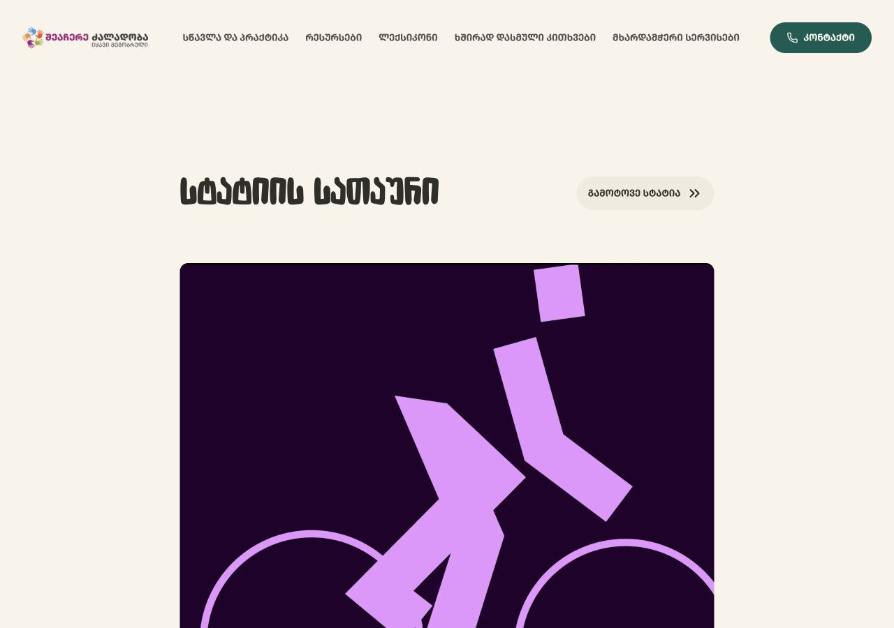
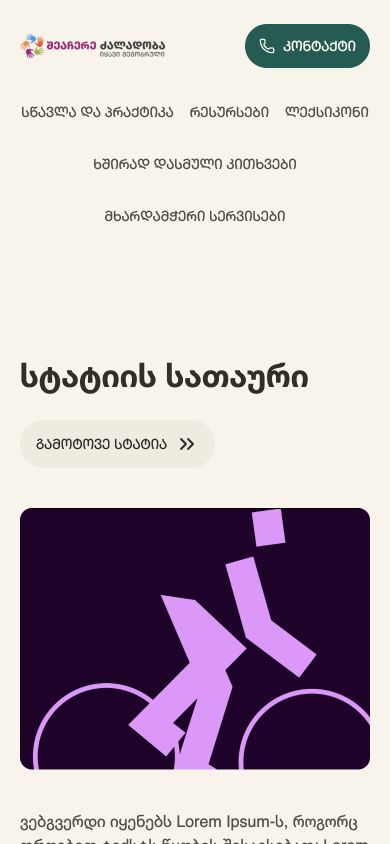

# Spacing audit — 14 September 2026

The existing scale is sufficient. The work needed is a shared set of rules for page layout, followed by replacing matching hardcoded values with tokens. No UI code changed.

## Existing foundation

The spacing scale is 4, 8, 12, 16, 20, 24, 32, 40, 48, 64, 80, 96, 120, 160px. Buttons, badges, alphabet controls, accordion rows, search and resource-card interiors mostly use it already. Desktop resource, learning and recommendation grids all use 32px gaps. Most catalogue content uses 32px desktop and 20px mobile gutters.

The scale numbers are identifiers, not arithmetic: space-7 is 32px, not 28px. Keep the scale; introduce semantic layout aliases so callers select a purpose rather than memorizing indices.

## Findings, in priority order

### 1. Catalogue vertical spacing has no shared rule

Comparable Learning and Resources pages use the following source values:

| Relationship | Learning desktop / mobile | Resources desktop / mobile |
| --- | --- | --- |
| Content start after header | 100 / 64px | 110 / 72px |
| Title block to filter toolbar | 82 / 48px | 150 / 88px |
| Space on each side of divider | 40 / 24px | 32 / 32px |
| Card grid gap | 32 / 24px | 32 / 20px |
| Main content bottom padding | 80 / 64px | 140 / 80px |

The different toolbar wrapping also changes total height, so aligning the first card's absolute screen position is not the right goal. Standardize these relationships while allowing the toolbar's content to wrap naturally. The large title-to-toolbar difference is the strongest candidate for a design decision.

### 2. Responsive spacing switches at different widths

Learning switches at 640px; Resources and Articles at 720px; Glossary at 760px; homepage and FAQ at 600px. This is not automatically wrong for layout structure, but common gutter/spacing roles should switch together. For example, between 641–720px Learning keeps 32px side padding while Resources has already moved to 20px. At 390px both have 20px gutters.

### 3. Section spacing is mostly hardcoded and includes unexplained one-offs

Examples: Learning title margin 82px, Resources intro 110/150px, Glossary intro 125/160px, article top 133px, homepage hero margin 114px, FAQ-page start 142px. Article recommendations use 176px bottom padding; homepage FAQ uses 240px. These are not all mistakes, but there is no documented section rhythm explaining them. Review large page relationships; do not mechanically round illustration dimensions or optical offsets.

### 4. Empty-state text stacks still differ

Glossary heading-to-body uses 24px and paragraph bottom 32px; Resources uses 16px and 28px. Align typography stacks once the designs are agreed. Different centered versus left-aligned layouts can remain intentional. Source-only finding; empty states were not triggered in this spacing pass.

### 5. A few component exceptions need documentation

Filter panel padding is 10px; option vertical padding is 11px; selected trigger icon gap is 16px versus 8px at rest. Resource action padding is an explicitly documented 14/22px optical exception; mobile contact padding is 10/14px. Keep existing dimensions during token cleanup unless a visual review supports changing them. Tokenization alone is not a reason to alter a working component.

## Preserve intentional differences

- Reading column: article uses a narrow 765px width; wide catalogues use a 1440px container. Do not force them into one width.
- Card families: framed learning cards and resource cards have different compositions. Their internal padding need not match.
- Accordion: 32px inset and 16px row gap are coherent. Mobile inset reduction could be explored, but is not an established defect.
- Glossary: 80px desktop column gap and 40px at the intermediate breakpoint support its two-column layout. The 16px term-to-definition and 32px divider offsets are coherent.
- Homepage hero: its illustration and fixed minimum height need composition-specific rules, not catalogue spacing.

## Recommended next implementation

1. Define semantic roles for page gutter, page-start spacing, title-to-controls, divider spacing, grid gap, section gap and text stack.
2. Choose the desired catalogue rhythm first, using the current designs as reference. Do not infer that Resources' approved typography means all its spacing is approved as the default.
3. Apply shared roles to Learning and Resources, then reading/FAQ/Glossary layouts where the relationships actually match.
4. Replace hardcoded values that already match the scale without visual changes; document deliberate exceptions.
5. Recheck intermediate widths as well as desktop/mobile. Then move to icons and motion.

## Scope and limits

Inspected the active page/component CSS and captured six routes at 1280×900 and 390×844. No document horizontal overflow was measured in those initial states. This is not full accessibility certification or an exhaustive breakpoint sweep. The restored typography tuner overlays the right side of the desktop Resources capture; its overlay is not a product spacing defect, and the obscured area is not visually certified. Saved metrics record the underlying DOM layout. Typography/font loading and the WIP age state can affect exact screen positions; source spacing relationships are the basis for the values above. Dialogs, the large age/scenario CTA, animated CardDeck and old unused prototype are excluded. Article placeholder content itself is not evaluated.

## Screen review

### 1. Resources

Needs shared catalogue rhythm; controls/cards fit.

### 2. Learning

Needs shared catalogue rhythm and mobile grid-gap decision.

### 3. Glossary

Internal rhythm coherent; page intro uses independent spacing.

### 4. FAQ

Accordion spacing coherent; section spacing independent.

### 5. Article

Reading width intentional; large page/section offsets need roles.

### 6. Homepage

Composition-specific hero spacing; preserve illustration relationship.

